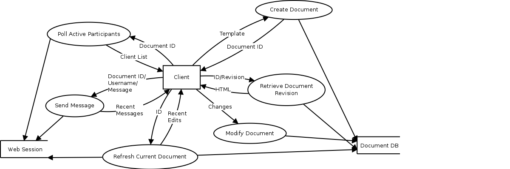
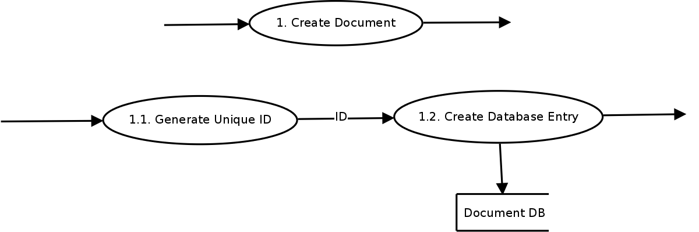
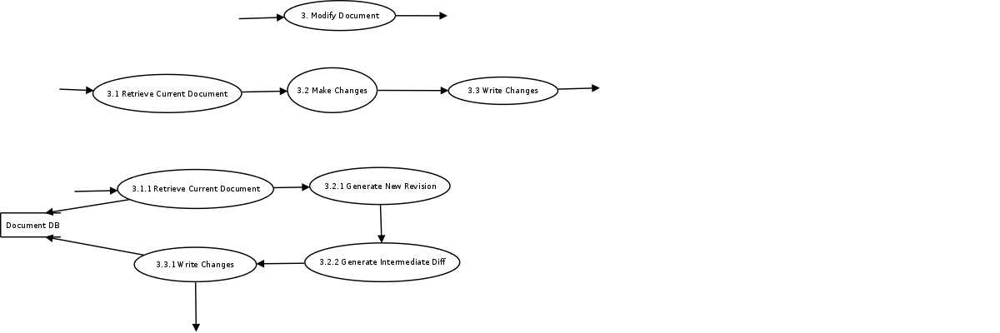
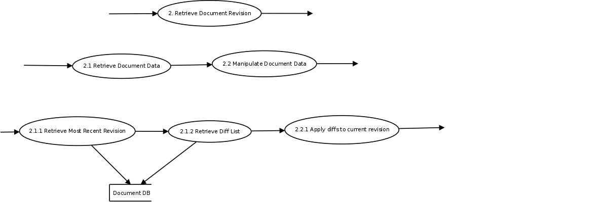
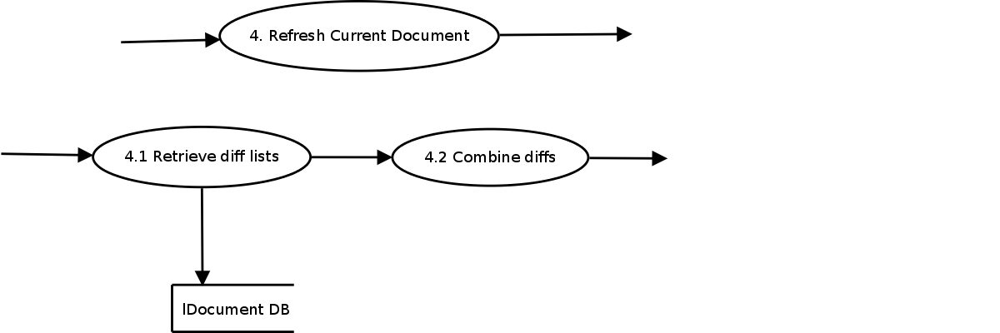
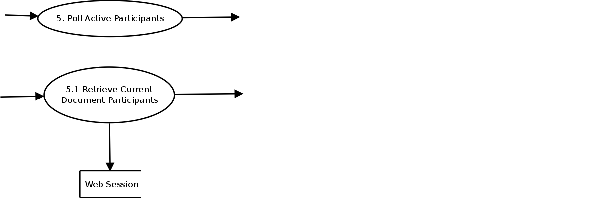
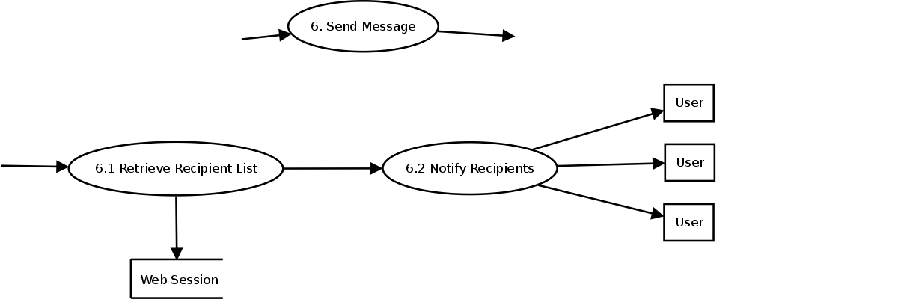

Data Flow Diagrams
==================

For the context level diagram, all data flow is centered around the client for a few reasons.  All actions are initiated by clients, and the central server only needs to respond to explicit client input.  Additionally, the purpose of the server is to provide a common way for clients to communicate and to resolve conflicts, but all communication ultimately begins and ends with the clients.

Context Level
-------------
After first defining the context level data flow diagram, every process is broken down into successive levels.  For each sub-level diagram, the context level entry being broken down is first shown for context.  Each successive level of flow is then displayed below the prior level of flow, presenting a deeper layer of context than the actions above it.

There are two primary data sources represented: Document DB and Web Session.  Document DB refers to the supporting database and contains all relevant permanent document storage.  Web Session deals with more volatile session data.  This type of data source is necessary for this project as its primary use involves real time interaction through a concept of a session.  Examples of information included in this data source is a listing of who is currently viewing a particular document so that they can be notified when changes are made.  All data stored in the web session is transient, and does not need to be stored in any sort of robust way.

Document Creation
-----------------
All documents are represented by a unique id that must be generated and an entry in the document db.

Document Modification
---------------------
One of the most complex flows, modifying a document depends on first ensuring that the document being edited is up to date.  A diff can then be generated and pushed to the server and all connected clients, to be written to the database and update all current views respectively.

View Revision
-------------
Documents are stored as their current revision and incremental diffs to revert to any prior revision.  Viewing a revision involves retrieving the head revision and applying any necessary diffs.

Document Refresh
----------------
Based on the version number the client has and the version number of the head revision, the server can generate a diff to send to the client to bring the document up to date.

User Listing
------------
Clients can periodically check which users are actively viewing the current document.

Chat Communication
------------------
When a user sends a message, that message needs to be broadcasted to all other connected users.  This information is contained in the Web Session data source.

